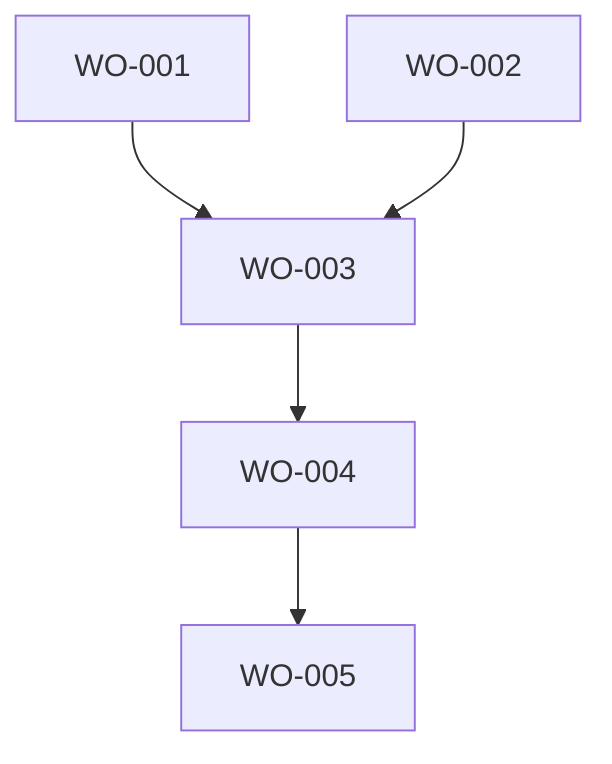

# Work Order Index Template

Generate and maintain a work order index for tracking all work orders in a project.

> **The GAS root index is generated — this template does not apply to it.** The
> GAS root work-order index is generated from WOQ and is **not** hand-maintained.
> `/Users/grig/.agents/.dev/ai/workorders/WO-INDEX.md` is retired; the index is
> `/Users/grig/.agents/.dev/ai/workorders/WO-INDEX.woq-generated-view.md`.
> Hand-writes to it are refused. Do not update the index and do not queue an
> index change for it. Update the Work Order file only — `woq work-order write`
> — and the index is rebuilt from it. Owner-approved cutover 2026-08-12,
> WO-GAS-WOQLIVE-014. Everything below is the template for **project-local**
> indexes in other Projects, which are unchanged.

## File Location
Save to: `{PROJECT_ROOT}/.dev/ai/workorders/WO-INDEX.md` (project-local indexes
only — see the note above for the GAS root).

## Shared Status Write Boundary

`WO-INDEX.md` is a shared status surface, not a normal hand-edited scratch
file. Read-only inspection is allowed. Any write or status synchronization must
use one of these safe paths:

- **GAS root index:** generated from WOQ, not hand-maintained — there is
  nothing to write. `/Users/grig/.agents/.dev/ai/workorders/WO-INDEX.md` is
  retired and the index is
  `/Users/grig/.agents/.dev/ai/workorders/WO-INDEX.woq-generated-view.md`.
  Hand-writes are refused by both `woq shared-status write` and `woq
  project-index write`. Do not update the index, do not queue an
  `index-pending` or `*-index-proposed.md` change for it, and do not name an
  index synchronization for it in a result artifact. Update the Work Order file
  only (`woq work-order write`); the index is rebuilt from it. Owner-approved
  cutover 2026-08-12, WO-GAS-WOQLIVE-014.
- **Project-local index:** acquire the project-local `.WO-INDEX.lock/`, reread
  the index after acquiring the lock, write only the scoped entry/status change,
  and release only your own lock. On lock contention, write the proposed update
  to `index-pending/<role>/` or the exact result artifact instead of waiting or
  overwriting.
- **Workers, QA, and read-only agents:** default to result-artifact-only
  shared-status authority. Their status updates must name the WO file change
  needed, plus — for a project-local index only — the `WO-INDEX.md`
  synchronization needed through the authorized parent, steward, liaison,
  triage, or maintenance writer lane. Name no index synchronization for the GAS
  root; the WO file change is the whole ask there.

Generated-boundary note: the narrow generated-section boundaries that once
applied inside the GAS root index (`woq-live-status`,
`gas-external-capability-integration`, `global-work-order-q-system`) are
superseded — the entire GAS root index is generated now, so no hand-maintained
section survives to except. See
`/Users/grig/.agents/docs/protocols/woq-role-lifecycle.md`. Project-local
indexes continue to use the safe paths above.

## Update Triggers
- When creating new work orders
- When completing work orders
- When updating work order status
- During handoff creation
- On "show work queue" command

## Index Structure

```markdown
# Work Order Index
**Last Updated:** [YYYY-MM-DD-HH-MM-SS]
**Project:** [Project Name]

## Outstanding Work Orders

### Critical Priority
| WO ID | Title | Status | Created | Created By | Blocked By | Age |
|-------|-------|--------|---------|------------|------------|-----|
| WO-xxx | [Title] | NOT_STARTED | [Date] | [Agent] | - | [Days] |

### High Priority
| WO ID | Title | Status | Created | Created By | Blocked By | Age |
|-------|-------|--------|---------|------------|------------|-----|
| WO-xxx | [Title] | IN_PROGRESS | [Date] | [Agent] | WO-yyy | [Days] |

### Medium Priority
| WO ID | Title | Status | Created | Created By | Blocked By | Age |
|-------|-------|--------|---------|------------|------------|-----|

### Low Priority
| WO ID | Title | Status | Created | Created By | Blocked By | Age |
|-------|-------|--------|---------|------------|------------|-----|

## Completed This Session
| WO ID | Title | Completed | Completed By | Time Taken |
|-------|-------|-----------|--------------|------------|
| WO-xxx | [Title] | [Timestamp] | [Agent] | [Actual vs Est] |

## Blocked Work Orders
| WO ID | Title | Blocked On | Reason |
|-------|-------|------------|--------|
| WO-xxx | [Title] | External approval | Waiting for customer |
| WO-yyy | [Title] | WO-xxx | Depends on completion |

## Work Order Statistics
- **Total Outstanding:** [Count]
- **Completed Today:** [Count]
- **Blocked:** [Count]
- **Average Age:** [Days]
- **Completion Rate:** [Percentage]

## Discovered Work (Not Yet WO)
Items found during work that may need work orders:
- [ ] [Description of potential work]
- [ ] [Another item needing investigation]

## Work Order Relationships

```

## Query Commands

Support these queries:

- "Show all outstanding work orders" → Display outstanding section
- "Show blocked work" → Display blocked section
- "Show work by priority" → Group by priority
- "Show oldest work orders" → Sort by age
- "Show work order dependencies" → Display relationship graph

## Maintenance Rules

1. **Never delete entries** - Move completed to archive
2. **Synchronize status through the safe boundary** when work order status
   changes: update the WO file only if your role has live-write authority, and
   synchronize a project-local `WO-INDEX.md` through the project-local lock or
   result-artifact fallback. For the GAS root there is no index step — the WO
   file write is the only write, and the generated index picks it up.
3. **Track all WOs** - Including those from previous sessions
4. **Age calculation** - Days since creation
5. **Relationship tracking** - Update blocks/blocked-by

## Archive Location

Completed work orders older than 7 days move to:
`.dev/ai/workorders/WO-ARCHIVE.md`

## Integration Points

- **With Handoffs:** Pull outstanding WO list from here
- **With Proposals:** Add generated WOs here
- **With Tracking:** Reference this in project tracking
- **With Reviews:** Update effectiveness scores here
- **With Accomplishments:** Auto-create accomplishment entries when WOs complete
- **With Changelogs:** Link to detailed change documentation

## Index Update Command

```bash
# After any WO status change
echo "Updated WO-xxx status to COMPLETED" >> .dev/ai/workorders/WO-CHANGELOG.md
# Synchronize WO file status through the allowed role boundary:
# - GAS root: WO file write only (woq work-order write). The index is generated
#   from WOQ and hand-writes to it are refused - there is no index step.
# - project-local: .WO-INDEX.lock/ + reread-after-lock + scoped update
# - worker/QA fallback: proposed WO file status (plus project-local index sync)
#   in result artifact
# Track change
~/.agents/scripts/track-project.sh "[project]" "WO Index updated" \
  "[change summary]" "[agent]"

# If status changed to COMPLETED, create accomplishment entry
if [[ "$NEW_STATUS" == "COMPLETED" ]]; then
  ~/.agents/scripts/create-accomplishment.sh "WO-xxx Title" "Feature Implementation" "WO-xxx" "[agent]"
  echo "Created accomplishment entry for completed WO-xxx"
fi
```
